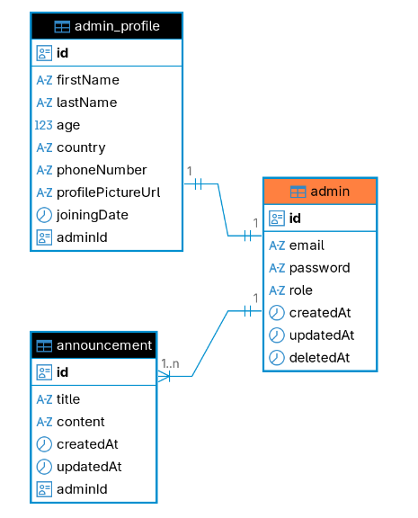

# RideSharing App (Backend)

---

---

Users: Admin, Driver, Rider, Employee

## Admin

- Tables

- Admin Routes:
  `AdminController` (`@Controller('/v1/api/admin')`)

| Method   | Route                                   | Guard       |
| -------- | --------------------------------------- | ----------- |
| `GET`    | `/v1/api/admin/admin-list`              | `AuthGuard` |
| `POST`   | `/v1/api/admin/create`                  | None        |
| `PATCH`  | `/v1/api/admin/update-admin/:id`        | None        |
| `PUT`    | `/v1/api/admin/:id/profile-picture`     | None        |
| `GET`    | `/v1/api/admin/get-announcements`       | `AuthGuard` |
| `POST`   | `/v1/api/admin/create-announcement`     | `AuthGuard` |
| `DELETE` | `/v1/api/admin/delete-announcement/:id` | `AuthGuard` |
| `DELETE` | `/v1/api/admin/delete-admin/:id`        | None        |
| `POST`   | `/v1/api/admin/send-email`              | None        |
